<!--
  Profile README for github.com/DeAtHfIrE26.
  - Hero + buttons: assets/, generated by scripts/build-static-assets.mjs
  - Project art: assets/projects/, copied from each showcase repo's hero
  - Activity card + snake: `output` branch, refreshed daily by .github/workflows/profile-assets.yml
-->

<a href="https://kashyappatel.vercel.app">
  <picture>
    <source media="(prefers-color-scheme: dark)" srcset="assets/hero-dark.svg">
    <source media="(prefers-color-scheme: light)" srcset="assets/hero-light.svg">
    
  </picture>
</a>

  
  
  
  
  

I'm a full-stack engineer from India 🇮🇳 who got into software through AI, reinforcement-learning agents and Unity games, and now builds production web apps across **.NET, React, Python and the cloud**. I care about systems that are fast and honest about their trade-offs, so every number on this page was measured, not estimated.

- **Now:** advanced ML and deep-learning projects, and exploring cloud computing and edge AI.
- **2026 goals:** master AI tools and automation, go deep on system design, and keep sharpening DSA.
- **Open to** collaborations on AI, ML and cloud projects. [Email me](mailto:kashyappatel2673@gmail.com).

## Featured work

Each of these is a deployed app with a private codebase. The linked repositories are public **showcases** I extracted from them: the UI, tests and tooling, runnable in one command, with the proprietary logic swapped for a mock behind the same interface.

### Document Intelligence Framework

<a href="https://docu-intelligence.vercel.app">
  <picture>
    <source media="(prefers-color-scheme: dark)" srcset="assets/projects/document-intelligence-dark.svg">
    <source media="(prefers-color-scheme: light)" srcset="assets/projects/document-intelligence-light.svg">
    
  </picture>
</a>

Upload a PDF, a scan, a note or an audio file and get back the people, places, dates and organisations in it, linked into a knowledge graph you can search, with AI answers that cite their sources.

| Measured | Before | After |
|---|--:|--:|
| Upload and process a 21 KB document | 230 s | **2.9 s** |
| Live search | 15.7 s | **0.33 s** |
| Embedding API requests per upload | 855 | **2** |

**Stack:** `Python` `Flask` `PostgreSQL + pgvector` `spaCy` `OpenAI` `Tesseract OCR` · showcase: `TypeScript` `Vite` `Vitest`, no framework, 13 KB of JS

**[Live app](https://docu-intelligence.vercel.app)** · **[Showcase repo](https://github.com/DeAtHfIrE26/document-intelligence-showcase)** · [30-second walkthrough](https://github.com/DeAtHfIrE26/document-intelligence-showcase/blob/main/assets/demo.gif)

### RideShare Incentive Platform

<a href="https://ride-share-incentive-platform.vercel.app">
  <picture>
    <source media="(prefers-color-scheme: dark)" srcset="assets/projects/rideshare-dark.svg">
    <source media="(prefers-color-scheme: light)" srcset="assets/projects/rideshare-light.svg">
    
  </picture>
</a>

A carpooling platform that pays people to share journeys. The showcase holds the app shell, a dependency-free motion system and a 72-check release-hygiene suite; the incentive, matching and pricing logic stays private.

| Measured | Before | After |
|---|--:|--:|
| Dashboard statistics API (7 serial queries → 2 waves) | 828.7 ms | **419.3 ms** |
| Journeys list, page 1, on 200k rows | 20.5 ms | **0.11 ms** |
| Worst cumulative layout shift | 0.481 | **0.019** |

**Stack:** `React 18` `TypeScript` `Vite` `Tailwind` `Radix / shadcn` `PostgreSQL` `Drizzle` `Zod` `Playwright`

**[Live app](https://ride-share-incentive-platform.vercel.app)** · **[Showcase repo](https://github.com/DeAtHfIrE26/rideshare-incentive-showcase)** · [28-second walkthrough](https://github.com/DeAtHfIrE26/rideshare-incentive-showcase/blob/main/assets/walkthrough.gif)

### HealthHubPro

<a href="https://healthhubproapp.vercel.app">
  <picture>
    <source media="(prefers-color-scheme: dark)" srcset="assets/projects/healthhubpro-dark.svg">
    <source media="(prefers-color-scheme: light)" srcset="assets/projects/healthhubpro-light.svg">
    
  </picture>
</a>

A health-tracking app for steps, sleep, hydration, workouts and challenges, with rule-based insights that always show their working. The showcase is its component library, plus parsers that stream a 300 MB Apple Health export in 4 MB slices without loading it into memory.

| Measured | Before | After |
|---|--:|--:|
| Chart chunk (Recharts → a custom SVG chart) | 99.4 kB gz | **2.1 kB gz** |
| Dashboard total blocking time, mobile | 349 ms | **175 ms** |
| Light-mode WCAG AA failures | 42 nodes | **fixed** |

**Stack:** `React 18` `TypeScript` `Vite` `Tailwind` `Radix UI` `Vitest` · 82 tests, Lighthouse 100 on desktop

**[Live app](https://healthhubproapp.vercel.app)** · **[Showcase repo](https://github.com/DeAtHfIrE26/healthhubpro-showcase)** · [Playground](https://deathfire26.github.io/healthhubpro-showcase/)

### Merkle Verify

<a href="https://merkle-verif.vercel.app">
  <picture>
    <source media="(prefers-color-scheme: dark)" srcset="assets/projects/merkle-verif-dark.svg">
    <source media="(prefers-color-scheme: light)" srcset="assets/projects/merkle-verif-light.svg">
    
  </picture>
</a>

A Merkle-tree and inclusion-proof verifier. Its engine is byte-compatible with a Solidity implementation and with OpenZeppelin's `StandardMerkleTree`, and differential tests hold it there. The showcase is the interactive visualizer: click a leaf, watch its proof light up, then tamper with it and watch the verdict flip.

- OpenZeppelin parity is **asserted across 12 leaf counts**. An earlier version matched only on powers of two, which a 5-address allowlist would have exposed with a confidently wrong root.
- **278 tests** in the private project: 119 unit, 41 Solidity↔TypeScript parity, and 118 end-to-end.
- Caught an ECDSA bug that a green test suite was hiding: the contract recovered the raw digest while the tests signed with the EIP-191 prefix.

**Stack:** `React 19` `TypeScript` `Vite` `Tailwind` `Vitest` · engine: `Solidity` `keccak256` `OpenZeppelin`

**[Live app](https://merkle-verif.vercel.app)** · **[Showcase repo](https://github.com/DeAtHfIrE26/merkle-verif-showcase)** · [Walkthrough](https://github.com/DeAtHfIrE26/merkle-verif-showcase/blob/main/assets/demo.gif)

<b>More projects: AI/ML, speech, computer vision, games</b>

 

| Project | What it does | Built with |
|---|---|---|
| [Intelligent Retriever](https://github.com/DeAtHfIrE26/Intelligent_Retriever) | AI document management with semantic search | TypeScript, React, Express, OpenAI |
| [AI Interview Coach](https://github.com/DeAtHfIrE26/futuristic-ai-interviewer) | Interview simulator with gaze tracking and voice authentication | Python, MediaPipe, Resemblyzer |
| [MemoTag: Dementia Care](https://github.com/DeAtHfIrE26/AI-Powered-Dementia-Care-Solution) | AI memory assistance for people living with dementia | TypeScript, React, Express, WebSockets |
| [MemoTag Voice Analysis](https://github.com/DeAtHfIrE26/VAS_Voice-Analysis-System) | Speech transcription and audio-feature analysis | Python, Whisper, Vosk, librosa, Streamlit |
| [Gujarati Text-to-Speech](https://github.com/DeAtHfIrE26/VITS-Based-Gujarati-Text-to-Speech-Model) | End-to-end VITS speech synthesis for Gujarati | Python, PyTorch, FastAPI |
| [ChatBot Doctor](https://github.com/DeAtHfIrE26/ChatBot_Doctor_Using_FTM) | LLaMA fine-tuned for medical Q&A, quantized to 4-bit | Python, Hugging Face, PEFT |
| [Unified Face Attend](https://github.com/DeAtHfIrE26/Unified-Face-Attend) | Real-time face-recognition attendance | Python, DeepFace (ArcFace), OpenCV, Firebase |
| [Document Retrieval System](https://github.com/DeAtHfIrE26/document_retrieval_system) | Document retrieval backend with a graph store | Python, FastAPI, Transformers, Neo4j |
| [Sentiment Analysis (KARY)](https://github.com/DeAtHfIrE26/Sentiment_Analysis) | Emotion-aware chatbot, built during an internship | Python, Flask, NLP |
| RL agents: [Lunar Landing](https://github.com/DeAtHfIrE26/AI_Lunar_Landing) · [Pac-Man](https://github.com/DeAtHfIrE26/AI_Pac_MAN_GAME) · [Kung Fu A3C](https://github.com/DeAtHfIrE26/KungFu_A3C) | Deep Q-learning, deep convolutional Q-learning and A3C agents | Python, PyTorch, Gymnasium |
| [Carpooling with Rewards](https://github.com/DeAtHfIrE26/Carpooling_With_RewardSystem) | Ride-sharing with a reward system | React, Express, MongoDB |
| [Doofus Adventure](https://github.com/DeAtHfIrE26/Doofus_Adventure_Game) | Unity platformer | C#, Unity |
| [Turn-based Chess-like Game](https://github.com/DeAtHfIrE26/Turn_based_ChessLike_Game) | Real-time multiplayer on a 5×5 board | JavaScript, Express, Socket.IO |
| [Portfolio](https://github.com/DeAtHfIrE26/kashyap-portfolio) | [kashyappatel.vercel.app](https://kashyappatel.vercel.app) | Next.js 14, GSAP, Three.js |

## Tech stack

**Languages** 
<picture>
  <source media="(prefers-color-scheme: dark)" srcset="https://skillicons.dev/icons?i=py,ts,js,cs,cpp,java,solidity,html,css&theme=dark">
  
</picture>

**Frontend** 
<picture>
  <source media="(prefers-color-scheme: dark)" srcset="https://skillicons.dev/icons?i=react,nextjs,angular,vite,tailwind,threejs,vitest&theme=dark">
  
</picture>

**Backend, data and cloud** 
<picture>
  <source media="(prefers-color-scheme: dark)" srcset="https://skillicons.dev/icons?i=dotnet,nodejs,express,flask,fastapi,postgres,mongodb,firebase,aws,gcp,azure,docker,kubernetes,terraform,githubactions,vercel,linux&theme=dark">
  
</picture>

**AI and ML** 
<picture>
  <source media="(prefers-color-scheme: dark)" srcset="https://skillicons.dev/icons?i=pytorch,tensorflow,sklearn,opencv&theme=dark">
  
</picture>

**Games and 3D** 
<picture>
  <source media="(prefers-color-scheme: dark)" srcset="https://skillicons.dev/icons?i=unity,unreal,godot,blender&theme=dark">
  
</picture>

**Also:** Hugging Face (Transformers, PEFT) · OpenAI API · spaCy · Whisper · MediaPipe · DeepFace · pgvector · Neo4j · Drizzle · Zod · Radix UI · Playwright · Socket.IO · WebSockets · Streamlit · Apache Spark · Ansible · Grafana · SQL · Cisco networking · OpenGL · Maya · Cocos2d · WordPress · Git · Postman · Figma · Jira · Trello · Slack · **Google Cloud Digital Leader**

## Activity

<picture>
  <source media="(prefers-color-scheme: dark)" srcset="https://raw.githubusercontent.com/DeAtHfIrE26/DeAtHfIrE26/output/stats-dark.svg">
  
</picture>

<picture>
  <source media="(prefers-color-scheme: dark)" srcset="https://raw.githubusercontent.com/DeAtHfIrE26/DeAtHfIrE26/output/snake-dark.svg">
  
</picture>

## Problem solving

I take part in LeetCode contests regularly, in C++ and Python, and my [NeetCode solutions](https://github.com/DeAtHfIrE26/neetcode-submissions) sync to GitHub automatically.

<a href="https://leetcode.com/Kashyap_patel26/">
  <picture>
    <source media="(prefers-color-scheme: dark)" srcset="https://leetcard.jacoblin.cool/Kashyap_patel26?theme=dark&ext=contest">
    
  </picture>
</a>

---

Header, buttons and activity card are generated by <a href="scripts">scripts in this repo</a>; the activity card and snake refresh daily via <a href=".github/workflows/profile-assets.yml">GitHub Actions</a>.

