<!--
  GENERATED by scripts/build-profile.mjs from scripts/profile/data.mjs.
  Edit the data or the components, then run: node scripts/build-profile.mjs
  Activity card + snake come from the `output` branch (.github/workflows/profile-assets.yml).
-->

<a href="https://kashyappatel.vercel.app"><picture>
  <source media="(prefers-color-scheme: dark)" srcset="assets/profile/hero-dark.svg">
  <source media="(prefers-color-scheme: light)" srcset="assets/profile/hero-light.svg">
  
</picture></a>

  
  
  
  
  
  

<picture>
  <source media="(prefers-color-scheme: dark)" srcset="assets/profile/counters-dark.svg">
  <source media="(prefers-color-scheme: light)" srcset="assets/profile/counters-light.svg">
  
</picture>

 

<picture>
  <source media="(prefers-color-scheme: dark)" srcset="assets/profile/header-about-dark.svg">
  <source media="(prefers-color-scheme: light)" srcset="assets/profile/header-about-light.svg">
  
</picture>

<picture>
  <source media="(prefers-color-scheme: dark)" srcset="assets/profile/about-dark.svg">
  <source media="(prefers-color-scheme: light)" srcset="assets/profile/about-light.svg">
  
</picture>

 

<picture>
  <source media="(prefers-color-scheme: dark)" srcset="assets/profile/header-experience-dark.svg">
  <source media="(prefers-color-scheme: light)" srcset="assets/profile/header-experience-light.svg">
  
</picture>

<picture>
  <source media="(prefers-color-scheme: dark)" srcset="assets/profile/experience-dark.svg">
  <source media="(prefers-color-scheme: light)" srcset="assets/profile/experience-light.svg">
  
</picture>

 

<picture>
  <source media="(prefers-color-scheme: dark)" srcset="assets/profile/header-flagships-dark.svg">
  <source media="(prefers-color-scheme: light)" srcset="assets/profile/header-flagships-light.svg">
  
</picture>

Each of these runs in production from a private codebase. The linked repositories are public **showcases** I extracted from them: the UI, the tests and the tooling, runnable in one command, with the proprietary logic swapped for a mock behind the same interface. Every number was measured, not estimated.

 

<a href="https://docu-intelligence.vercel.app"><picture>
  <source media="(prefers-color-scheme: dark)" srcset="assets/projects/document-intelligence-dark.svg">
  <source media="(prefers-color-scheme: light)" srcset="assets/projects/document-intelligence-light.svg">
  
</picture></a>

<a href="https://docu-intelligence.vercel.app"><picture>
  <source media="(prefers-color-scheme: dark)" srcset="assets/profile/flagship-document-intelligence-dark.svg">
  <source media="(prefers-color-scheme: light)" srcset="assets/profile/flagship-document-intelligence-light.svg">
  
</picture></a>

  
  

<b>Watch the Document Intelligence Framework walkthrough</b> (animated GIF)

 

 

<a href="https://ride-share-incentive-platform.vercel.app"><picture>
  <source media="(prefers-color-scheme: dark)" srcset="assets/projects/rideshare-dark.svg">
  <source media="(prefers-color-scheme: light)" srcset="assets/projects/rideshare-light.svg">
  
</picture></a>

<a href="https://ride-share-incentive-platform.vercel.app"><picture>
  <source media="(prefers-color-scheme: dark)" srcset="assets/profile/flagship-rideshare-dark.svg">
  <source media="(prefers-color-scheme: light)" srcset="assets/profile/flagship-rideshare-light.svg">
  
</picture></a>

  
  

<b>Watch the RideShare Incentive Platform walkthrough</b> (animated GIF)

 

 

<a href="https://healthhubproapp.vercel.app"><picture>
  <source media="(prefers-color-scheme: dark)" srcset="assets/projects/healthhubpro-dark.svg">
  <source media="(prefers-color-scheme: light)" srcset="assets/projects/healthhubpro-light.svg">
  
</picture></a>

<a href="https://healthhubproapp.vercel.app"><picture>
  <source media="(prefers-color-scheme: dark)" srcset="assets/profile/flagship-healthhubpro-dark.svg">
  <source media="(prefers-color-scheme: light)" srcset="assets/profile/flagship-healthhubpro-light.svg">
  
</picture></a>

  
  
  

<b>Watch the HealthHubPro walkthrough</b> (animated GIF)

 

 

<a href="https://merkle-verif.vercel.app"><picture>
  <source media="(prefers-color-scheme: dark)" srcset="assets/projects/merkle-verif-dark.svg">
  <source media="(prefers-color-scheme: light)" srcset="assets/projects/merkle-verif-light.svg">
  
</picture></a>

<a href="https://merkle-verif.vercel.app"><picture>
  <source media="(prefers-color-scheme: dark)" srcset="assets/profile/flagship-merkle-verif-dark.svg">
  <source media="(prefers-color-scheme: light)" srcset="assets/profile/flagship-merkle-verif-light.svg">
  
</picture></a>

  
  

<b>Watch the Merkle Verify walkthrough</b> (animated GIF)

 

 

<a href="https://github.com/DeAtHfIrE26/Next-Generation-Virtual-Interview-Training-System"><picture>
  <source media="(prefers-color-scheme: dark)" srcset="assets/profile/interview-coach-art-dark.svg">
  <source media="(prefers-color-scheme: light)" srcset="assets/profile/interview-coach-art-light.svg">
  
</picture></a>

<a href="https://github.com/DeAtHfIrE26/Next-Generation-Virtual-Interview-Training-System"><picture>
  <source media="(prefers-color-scheme: dark)" srcset="assets/profile/flagship-interview-coach-dark.svg">
  <source media="(prefers-color-scheme: light)" srcset="assets/profile/flagship-interview-coach-light.svg">
  
</picture></a>

  
  

<b>Watch the AI Interview Coach walkthrough</b> (animated GIF)

 

 

<picture>
  <source media="(prefers-color-scheme: dark)" srcset="assets/profile/header-projects-dark.svg">
  <source media="(prefers-color-scheme: light)" srcset="assets/profile/header-projects-light.svg">
  
</picture>

<a href="https://github.com/DeAtHfIrE26/Intelligent_Retriever"><picture>
  <source media="(prefers-color-scheme: dark)" srcset="assets/profile/card-intelligent-retriever-dark.svg">
  <source media="(prefers-color-scheme: light)" srcset="assets/profile/card-intelligent-retriever-light.svg">
  
</picture></a>
<a href="https://github.com/DeAtHfIrE26/AI-Powered-Dementia-Care-Solution"><picture>
  <source media="(prefers-color-scheme: dark)" srcset="assets/profile/card-memotag-dark.svg">
  <source media="(prefers-color-scheme: light)" srcset="assets/profile/card-memotag-light.svg">
  
</picture></a>
<a href="https://github.com/DeAtHfIrE26/VAS_Voice-Analysis-System"><picture>
  <source media="(prefers-color-scheme: dark)" srcset="assets/profile/card-vas-dark.svg">
  <source media="(prefers-color-scheme: light)" srcset="assets/profile/card-vas-light.svg">
  
</picture></a>
<a href="https://github.com/DeAtHfIrE26/Unified-Face-Attend"><picture>
  <source media="(prefers-color-scheme: dark)" srcset="assets/profile/card-face-attend-dark.svg">
  <source media="(prefers-color-scheme: light)" srcset="assets/profile/card-face-attend-light.svg">
  
</picture></a>
<a href="https://github.com/DeAtHfIrE26/VITS-Based-Gujarati-Text-to-Speech-Model"><picture>
  <source media="(prefers-color-scheme: dark)" srcset="assets/profile/card-gujarati-tts-dark.svg">
  <source media="(prefers-color-scheme: light)" srcset="assets/profile/card-gujarati-tts-light.svg">
  
</picture></a>
<a href="https://github.com/DeAtHfIrE26/ChatBot_Doctor_Using_FTM"><picture>
  <source media="(prefers-color-scheme: dark)" srcset="assets/profile/card-chatbot-doctor-dark.svg">
  <source media="(prefers-color-scheme: light)" srcset="assets/profile/card-chatbot-doctor-light.svg">
  
</picture></a>
<a href="https://github.com/DeAtHfIrE26/Sentiment_Analysis"><picture>
  <source media="(prefers-color-scheme: dark)" srcset="assets/profile/card-kary-dark.svg">
  <source media="(prefers-color-scheme: light)" srcset="assets/profile/card-kary-light.svg">
  
</picture></a>
<a href="https://github.com/DeAtHfIrE26/document_retrieval_system"><picture>
  <source media="(prefers-color-scheme: dark)" srcset="assets/profile/card-doc-retrieval-dark.svg">
  <source media="(prefers-color-scheme: light)" srcset="assets/profile/card-doc-retrieval-light.svg">
  
</picture></a>
<a href="https://github.com/DeAtHfIrE26/AI_Lunar_Landing"><picture>
  <source media="(prefers-color-scheme: dark)" srcset="assets/profile/card-rl-agents-dark.svg">
  <source media="(prefers-color-scheme: light)" srcset="assets/profile/card-rl-agents-light.svg">
  
</picture></a>
<a href="https://github.com/DeAtHfIrE26/Carpooling_With_RewardSystem"><picture>
  <source media="(prefers-color-scheme: dark)" srcset="assets/profile/card-carpool-dark.svg">
  <source media="(prefers-color-scheme: light)" srcset="assets/profile/card-carpool-light.svg">
  
</picture></a>
<a href="https://github.com/DeAtHfIrE26/Turn_based_ChessLike_Game"><picture>
  <source media="(prefers-color-scheme: dark)" srcset="assets/profile/card-chess-dark.svg">
  <source media="(prefers-color-scheme: light)" srcset="assets/profile/card-chess-light.svg">
  
</picture></a>
<a href="https://github.com/DeAtHfIrE26/Doofus_Adventure_Game"><picture>
  <source media="(prefers-color-scheme: dark)" srcset="assets/profile/card-doofus-dark.svg">
  <source media="(prefers-color-scheme: light)" srcset="assets/profile/card-doofus-light.svg">
  
</picture></a>
<a href="https://github.com/DeAtHfIrE26/kashyap-portfolio"><picture>
  <source media="(prefers-color-scheme: dark)" srcset="assets/profile/card-portfolio-dark.svg">
  <source media="(prefers-color-scheme: light)" srcset="assets/profile/card-portfolio-light.svg">
  
</picture></a>
<a href="https://github.com/DeAtHfIrE26/neetcode-submissions"><picture>
  <source media="(prefers-color-scheme: dark)" srcset="assets/profile/card-neetcode-dark.svg">
  <source media="(prefers-color-scheme: light)" srcset="assets/profile/card-neetcode-light.svg">
  
</picture></a>

Reinforcement-learning trio: <a href="https://github.com/DeAtHfIrE26/AI_Lunar_Landing">Lunar Landing</a> · <a href="https://github.com/DeAtHfIrE26/AI_Pac_MAN_GAME">Pac-Man</a> · <a href="https://github.com/DeAtHfIrE26/KungFu_A3C">Kung Fu A3C</a>

 

<picture>
  <source media="(prefers-color-scheme: dark)" srcset="assets/profile/header-research-dark.svg">
  <source media="(prefers-color-scheme: light)" srcset="assets/profile/header-research-light.svg">
  
</picture>

<picture>
  <source media="(prefers-color-scheme: dark)" srcset="assets/profile/research-dark.svg">
  <source media="(prefers-color-scheme: light)" srcset="assets/profile/research-light.svg">
  
</picture>

 

<picture>
  <source media="(prefers-color-scheme: dark)" srcset="assets/profile/header-certifications-dark.svg">
  <source media="(prefers-color-scheme: light)" srcset="assets/profile/header-certifications-light.svg">
  
</picture>

<picture>
  <source media="(prefers-color-scheme: dark)" srcset="assets/profile/certifications-dark.svg">
  <source media="(prefers-color-scheme: light)" srcset="assets/profile/certifications-light.svg">
  
</picture>

 

<picture>
  <source media="(prefers-color-scheme: dark)" srcset="assets/profile/header-stack-dark.svg">
  <source media="(prefers-color-scheme: light)" srcset="assets/profile/header-stack-light.svg">
  
</picture>

<picture>
  <source media="(prefers-color-scheme: dark)" srcset="assets/profile/marquee-dark.svg">
  <source media="(prefers-color-scheme: light)" srcset="assets/profile/marquee-light.svg">
  
</picture>

<picture>
  <source media="(prefers-color-scheme: dark)" srcset="assets/profile/skills-dark.svg">
  <source media="(prefers-color-scheme: light)" srcset="assets/profile/skills-light.svg">
  
</picture>

  <picture>
    <source media="(prefers-color-scheme: dark)" srcset="https://skillicons.dev/icons?i=py,ts,js,cs,cpp,java,solidity,html,css&theme=dark&perline=12">
    
  </picture>
   
  <picture>
    <source media="(prefers-color-scheme: dark)" srcset="https://skillicons.dev/icons?i=react,nextjs,angular,vite,tailwind,threejs,nodejs,express,dotnet,flask,fastapi&theme=dark&perline=12">
    
  </picture>
   
  <picture>
    <source media="(prefers-color-scheme: dark)" srcset="https://skillicons.dev/icons?i=postgres,mongodb,redis,firebase,azure,aws,gcp,docker,kubernetes,terraform,githubactions,vercel&theme=dark&perline=12">
    
  </picture>
   
  <picture>
    <source media="(prefers-color-scheme: dark)" srcset="https://skillicons.dev/icons?i=pytorch,tensorflow,sklearn,opencv,unity,unreal,godot,blender,linux,git,figma,postman&theme=dark&perline=12">
    
  </picture>

 

<picture>
  <source media="(prefers-color-scheme: dark)" srcset="assets/profile/header-activity-dark.svg">
  <source media="(prefers-color-scheme: light)" srcset="assets/profile/header-activity-light.svg">
  
</picture>

<picture>
  <source media="(prefers-color-scheme: dark)" srcset="https://raw.githubusercontent.com/DeAtHfIrE26/DeAtHfIrE26/output/stats-dark.svg">
  <source media="(prefers-color-scheme: light)" srcset="https://raw.githubusercontent.com/DeAtHfIrE26/DeAtHfIrE26/output/stats-light.svg">
  
</picture>

<picture>
  <source media="(prefers-color-scheme: dark)" srcset="https://streak-stats.demolab.com?user=DeAtHfIrE26&hide_border=true&card_width=560&theme=github-dark-blue&ring=A78BFA&fire=22D3EE&currStreakLabel=A78BFA">
  <source media="(prefers-color-scheme: light)" srcset="https://streak-stats.demolab.com?user=DeAtHfIrE26&hide_border=true&card_width=560&theme=default&ring=6D28D9&fire=0E7490&currStreakLabel=6D28D9">
  
</picture>
<picture>
  <source media="(prefers-color-scheme: dark)" srcset="https://github-profile-trophy.vercel.app/?username=DeAtHfIrE26&theme=onedark&no-frame=true&no-bg=true&row=2&column=3&margin-w=6&margin-h=6">
  <source media="(prefers-color-scheme: light)" srcset="https://github-profile-trophy.vercel.app/?username=DeAtHfIrE26&theme=flat&no-frame=true&no-bg=true&row=2&column=3&margin-w=6&margin-h=6">
  
</picture>

<picture>
  <source media="(prefers-color-scheme: dark)" srcset="https://github-readme-activity-graph.vercel.app/graph?username=DeAtHfIrE26&hide_border=true&area=true&radius=16&bg_color=0d1117&color=a78bfa&line=22d3ee&point=e6edf3&area_color=a78bfa">
  <source media="(prefers-color-scheme: light)" srcset="https://github-readme-activity-graph.vercel.app/graph?username=DeAtHfIrE26&hide_border=true&area=true&radius=16&bg_color=ffffff&color=6d28d9&line=0e7490&point=1f2328&area_color=6d28d9">
  
</picture>

<picture>
  <source media="(prefers-color-scheme: dark)" srcset="https://raw.githubusercontent.com/DeAtHfIrE26/DeAtHfIrE26/output/snake-dark.svg">
  <source media="(prefers-color-scheme: light)" srcset="https://raw.githubusercontent.com/DeAtHfIrE26/DeAtHfIrE26/output/snake-light.svg">
  
</picture>

 

<picture>
  <source media="(prefers-color-scheme: dark)" srcset="assets/profile/header-dsa-dark.svg">
  <source media="(prefers-color-scheme: light)" srcset="assets/profile/header-dsa-light.svg">
  
</picture>

I take part in LeetCode contests regularly, in C++ and Python, and every accepted [NeetCode solution](https://github.com/DeAtHfIrE26/neetcode-submissions) syncs to GitHub automatically.

<a href="https://leetcode.com/u/Kashyap_patel26/"><picture>
  <source media="(prefers-color-scheme: dark)" srcset="https://leetcard.jacoblin.cool/Kashyap_patel26?theme=dark&font=Inter&ext=contest&border=0&radius=16">
  <source media="(prefers-color-scheme: light)" srcset="https://leetcard.jacoblin.cool/Kashyap_patel26?theme=light&font=Inter&ext=contest&border=0&radius=16">
  
</picture></a>

 

<a href="mailto:kashyappatel2673@gmail.com"><picture>
  <source media="(prefers-color-scheme: dark)" srcset="assets/profile/footer-dark.svg">
  <source media="(prefers-color-scheme: light)" srcset="assets/profile/footer-light.svg">
  
</picture></a>

  

